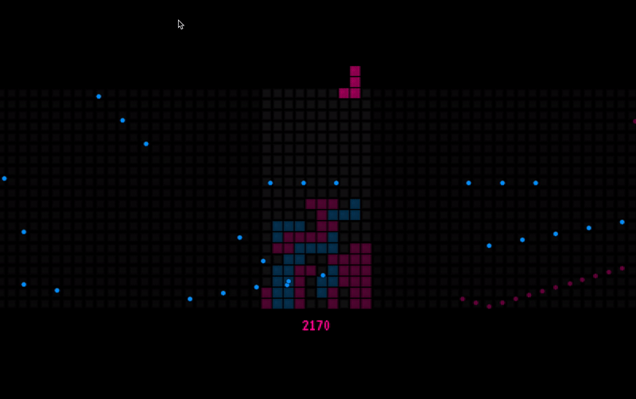

# Tetrikaruga (LD41)

A game made in 2 days during Ludum Dare gamejam by @greweb.

Theme was _“Combine 2 Incompatible Games”_.

My game is a mashup between Tetris and Ikaruga bullet hell mecanism.

You can absorb bullets that have same color as you but if you touch another color, this is game over.

There are 2 colors and you switch between them when rotating the Tetris brick.

Game difficulty escalates over rows.

